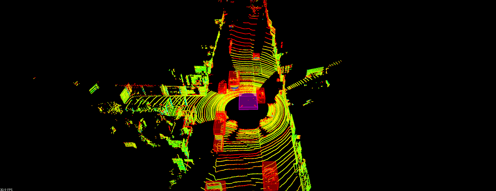

## Introduction

LiDAR data is stored in a format called Point Cloud Data (PCD for short). A PCD file is a list of (x,y,z) Cartesian coordinates along with intensity values. The animation above shows the PCD of a city block with parked cars, and a passing van. Intensity values are being shown as different colors.

In this project, we will be be working on processing point cloud data to find obstacles with the help of PCL. [Point Cloud Library (**PCL**)](<http://pointclouds.org/>)  is an open source C++ library for 2D/3D image and point cloud processing. We will use it to visualize data, render shapes, and take advantage of some built in functions to process point cloud data. Built in PCL functions that will be used later in this project are Segmentation, Extraction, and Clustering.

You can find the [C++ Implementation](<https://github.com/yasenh/SFND_Lidar_Obstacle_Detection>) on my GitHub.

## Point Cloud Segmentation

Segment the filtered cloud into two parts, road and obstacles.

## Clustering Obstacles

Cluster the obstacle cloud.

## Generate bounding boxes

Find bounding boxes for the clusters

## Challenge

## References

1. [Udacity Sensor Fusion Nanodegree Program](<https://www.udacity.com/course/sensor-fusion-engineer-nanodegree--nd313>) 