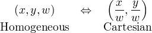
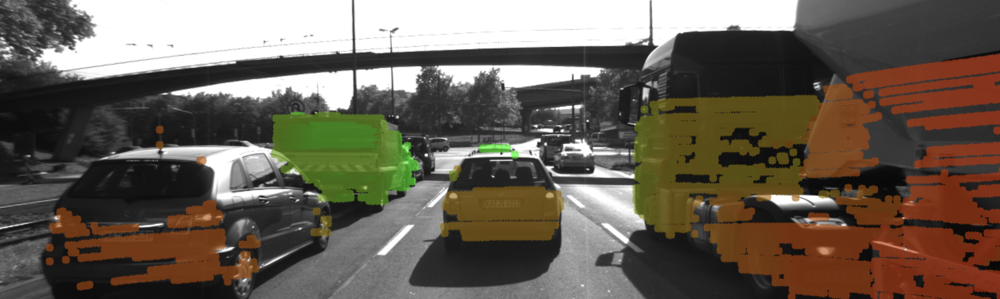

## What is Homogeneous Coordinates?

In mathematics, **homogeneous coordinates** or **projective coordinates** is a system of coordinates used in projective geometry, as Cartesian coordinates used in Euclidean geometry. It is a coordinate system that algebraically treats all points in the projective plane (both Euclidean and ideal) equally.

Suppose we have a point $(x,y)$ in the Cartesian coordinates. To represent this same point in the homogeneous coordinates, we simply add a third coordinate of 1 at the end: $(x, y, 1)$. 

If the homogeneous coordinates of a point are multiplied by a non-zero scalar then the resulting coordinates represent the same point.

For example, the point (1.4, -1.6) in Cartesian coordinates is the same as: 

- (1.4, -1.6, 1) 

- or (2.8, -3.2, 2) 

- or (0.7, -0.8, 0.5) 

- or even (1400, -1600, 1000) in homogeneous coordinates. 

  

## Why Using Homogeneous Coordinates?

One of the advantages of homogeneous coordinates is that they allow for an easy combination of multiple transformations by concatenating several matrix-vector multiplications.

Let's assume we want to do some data augmentation for a image dataset. The popular augmentation technique, or projective geometry works in 2D, includes: scale, rotate and translate.


#### Scale

$$
\begin{bmatrix} x_1 \\\\\\ y_1 \end{bmatrix} 
= \begin{bmatrix} k_x & 0 \\\\\\ 0 & k_y \end{bmatrix} 
\begin{bmatrix} x_0 \\\\\\ y_0 \end{bmatrix}
$$


#### Rotate

$$
\begin{bmatrix} x_1 \\\\\\ y_1 \end{bmatrix} 
= \begin{bmatrix} \cos\theta & -\sin\theta \\\\\\ \sin\theta & \cos\theta \end{bmatrix} 
\begin{bmatrix} x_0 \\\\\\ y_0 \end{bmatrix}
$$


#### Translate

$$
\begin{bmatrix} x_1 \\\\\\ y_1 \end{bmatrix} 
= \begin{bmatrix} x_0 \\\\\\ y_0 \end{bmatrix} + \begin{bmatrix} t_x \\\\\\ t_y \end{bmatrix}
$$


Both scale and rotate operation are represented by matrix multiplication. So for example, we can scale up the image size by twice, then rotate 45 degree, and finally scale down to half of the size by multiplying three matrices:
$$
\begin{bmatrix} x_1 \\\\\\ y_1 \end{bmatrix}
= \begin{bmatrix} 2 & 0 \\\\\\ 0 & 2 \end{bmatrix} 
\begin{bmatrix} \cos\frac{\pi}{4} & -\sin\frac{\pi}{4} \\\\\\ 
\sin\frac{\pi}{4} & \cos\frac{\pi}{4} \end{bmatrix} 
\begin{bmatrix} 0.5 & 0 \\\\\\ 0 & 0.5 \end{bmatrix} 
\begin{bmatrix} x_0 \\\\\\ y_0 \end{bmatrix}
$$


However, what if we want to do the translate operation at the same time? We note that translate operation is represented by matrix addition rather then multiplication. So we cannot combine the translation with scaling and rotation within a simple matrix multiplication equation.


> So what should be do?

Here we will introduce **Homogeneous Coordinates**, which will increase the dimension of current coordinates. In our case, 2D points will become 3D points in homogeneous coordinates.


#### Scale in Homogeneous Coordinates

$$
\begin{bmatrix} x_1 \\\\\\ y_1 \\\\\\ 1 \end{bmatrix} 
= \begin{bmatrix} k_x & 0 & 0 \\\\\\ 0 & k_y & 0 \\\\\\ 0 & 0 & 1 \end{bmatrix} 
\begin{bmatrix} x_0 \\\\\\ y_0 \\\\\\ 1 \end{bmatrix}
$$


#### Rotate in Homogeneous Coordinates

$$
\begin{bmatrix} x_1 \\\\\\ y_1 \\\\\\ 1 \end{bmatrix} 
= \begin{bmatrix} \cos\theta & -\sin\theta & 0 \\\\\\ \sin\theta & \cos\theta & 0 \\\\\\ 0 & 0 & 1 \end{bmatrix} 
\begin{bmatrix} x_0 \\\\\\ y_0 \\\\\\ 1 \end{bmatrix}
$$


#### Translate in Homogeneous Coordinates

$$
\begin{bmatrix} x_1 \\\\\\ y_1 \\\\\\ 1 \end{bmatrix} 
= \begin{bmatrix} 1 & 0 & t_x \\\\\\ 0 & 1 & t_y \\\\\\ 0 & 0 & 1 \end{bmatrix} 
\begin{bmatrix} x_0 \\\\\\ y_0 \\\\\\ 1 \end{bmatrix}
$$


So now in homogeneous coordinates, we are able to do scaling, rotation and translation by simple matrix multiplication instead of applying all the transformations separately, which is much more convenient for us when we want to combine these operations together.


## Example - LiDAR to Camera Point Projection

In order to convert from Homogeneous coordinates $(x, y, w)$ to Cartesian coordinates, we simply divide $x$ and $y$ by $w$;




Let's give an example, our goal here is to project LiDAR point cloud from 3D space onto the image plane in 2D.

In addition to the intrinsic camera parameters which make up the geometry of the projection, we need additional information about the position and alignment of both camera and LiDAR in a common reference coordinate system. To move from LiDAR to camera involves translation and rotation operations, which we need to apply to every 3D point. So our goal here is to simplify the notation with which we can express the projection. Using a linear transformation (or mapping), 3D points could be represented by a vector and operations such as translation, rotation, scaling and perspective projection could be represented as matrices by which the vector is multiplied. 


Once we are in the homogeneous coordinate system, projective transformations become linear and can thus be expressed as simple matrix-vector multiplications. 


$$
\overbrace{
\begin{bmatrix} u \\\\\\ v \\\\\\ 1 \end{bmatrix}
}^\text{2D Camera}    
= \overbrace{
     \begin{bmatrix}
     1  &  0  & x_0 \\\\\\
     0  &  1  & y_0 \\\\\\
     0  &  0  & 1
     \end{bmatrix} 
     \times
     \begin{bmatrix}
     f_x &  0  & 0 \\\\\\
     0  & f_y & 0 \\\\\\
     0  &  0  & 1
     \end{bmatrix} 
     \times
     \begin{bmatrix}
     1  &  s/f_x  & 0 \\\\\\
     0  &    1    & 0 \\\\\\
     0  &    0    & 1
     \end{bmatrix} 
}^\text{Intrinsic Matrix}
     \times
\overbrace{     
     \begin{bmatrix}
     I & \mathbf{t}
     \end{bmatrix} 
     \times
     \begin{bmatrix}
     R & 0 \\\\\\
     0 & 1
     \end{bmatrix} 
}^\text{Extrinsic Matrix}     
     \times
     \overbrace{
     \begin{bmatrix} X \\\\\\ Y \\\\\\ Z \\\\\\ 1 \end{bmatrix}
     }^\text{3D LiDAR}  
$$


#### C++ Implementation:


```cpp
// LiDAR point in homogeneous coordinates
cv::Mat X(4, 1, cv::DataType<double>::type);
// Camera pixel in homogeneous coordinates
cv::Mat Y(3, 1, cv::DataType<double>::type);
for (const auto& lidarPoint : lidarPoints) {
    // assemble vector for matrix-vector-multiplication
    X.at<double>(0, 0) = lidarPoint.x;
    X.at<double>(1, 0) = lidarPoint.y;
    X.at<double>(2, 0) = lidarPoint.z;
    X.at<double>(3, 0) = 1;
    // project LiDAR point into camera
    Y = intrinsicMatrix * extrinsicMatrix * X;
    cv::Point pt;
    // pixel coordinates
    pt.x = static_cast<int>(Y.at<double>(0, 0) / Y.at<double>(2, 0)); 
    pt.y = static_cast<int>(Y.at<double>(1, 0) / Y.at<double>(2, 0));
}
```





## References

1. [Udacity Sensor Fusion Nanodegree Program](<https://www.udacity.com/course/sensor-fusion-engineer-nanodegree--nd313>) 
2. [Homogeneous Coordinates](<http://www.songho.ca/math/homogeneous/homogeneous.html>)
3. [Wikipedia](https://en.m.wikipedia.org/wiki/Homogeneous_coordinates)
4. [Stanford Homogeneous coordinates Explaination](http://robotics.stanford.edu/~birch/projective/node4.html)
5. [Interactive guide to homogeneous coordinates](https://wordsandbuttons.online/interactive_guide_to_homogeneous_coordinates.html)
6. [Dissecting the Camera Matrix, Part 3: The Intrinsic Matrix](<http://ksimek.github.io/2013/08/13/intrinsic/>)
7. [为什么要引入齐次坐标](https://blog.csdn.net/saltriver/article/details/79680364)