## Introduction

From  [wikipedia](https://en.wikipedia.org/wiki/Hungarian_algorithm), the  **Hungarian method** is a combinatorial optimization algorithm that solves the  assignment problem in polynomial time and which anticipated later primal-dual methods. It was developed and published in 1955 by Harold Kuhn, who gave the name "Hungarian method" because the algorithm was largely based on the earlier works of two Hungarian mathematicians: Dénes Kőnig and Jenő Egerváry.


## Prerequisite

###  Bipartite Graph

From [wikipedia](https://en.wikipedia.org/wiki/Bipartite_graph), a **bipartite graph** (or **bigraph**) is a graph whose vertices can be divided into two disjoint and independent sets ***U*** and ***V*** such that every edge connects a vertex in ***U*** to one in ***V***. Vertex sets ***U*** and ***V*** are usually called the *parts* of the graph. Equivalently, a bipartite graph is a graph that does not contain any odd-length cycles. Following graph is actually a bipartite graph:


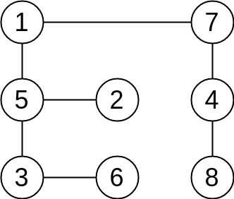


For clarity, here we redraw the figure above as:


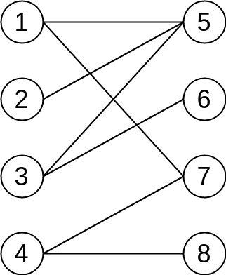


### Matching 

Given a graph $G = (V,E)$, a **matching** *M* in *G* is a set of pairwise non-adjacent edges, none of which are loops, that is, no two edges share a common vertex.

A vertex is **matched** (or **saturated**) if it is an endpoint of one of the edges in the matching. Otherwise the vertex is **unmatched**.

For example, one matching is consisted of two red edges in the figure below.

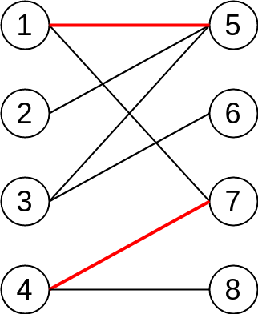


A **maximum matching** is a matching that contains the largest possible number of edges. There may be many maximum matchings.

A **perfect matching** is a matching which matches all vertices of the graph. That is, every vertex of the graph is incident to exactly one edge of the matching.   In some literature, the term **complete matching** is used. A perfect matching can only occur when the graph has an even number of vertices. And even so, a graph may not have its perfect matching.

> Every perfect matching is maximum matching. However, a maximum matching is not necessarily to be a perfect matching.


 The following figure shows examples of a prefect(also maximum) matching.


### Alternating Path and Augmenting Path

Given a matching *M*,

- an **alternating path** is a path that begins with an **unmatched vertex** and whose edges belong alternately to the matching and not to the matching.
- an **augmenting path** is an alternating path that starts from and ends on (two different) unmatched vertices.


> The path length(total number of edges) of augmenting path must be an odd number.


Here is an example:

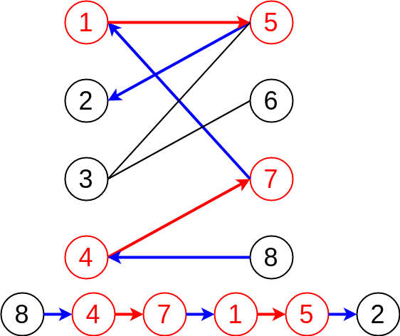

In current graph, we have 2 matchings (1<-->5, 4<-->7 ), so that vertices 1, 4, 5, 7 are matched vertices. Now, let's try to find a augmenting path from the graph. Starting from an unmatched vertex **8**, then we follow the alternating path (unmatched edge -> matched edge -> unmatched edge...), finally end up with **another** unmatched vertex.

Note that we have **2 matched edges and 3 unmatched edges** in current augmenting path. Because we always starts and ends on unmatched vertices, which in other words, we start and ends with unmatched edges. It is obvious that the total number of unmatched edges is always greater than the number of matched edges by 1.

$$N_{unmatched} = N_{match} + 1$$


> Why it is called augmenting path?

Think about switch between unmatched edges and matched edges in the augmenting path:

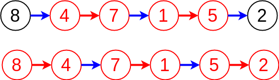


So in this way, unmatched edges become to matched edges, and vice versa, matched edges become unmatched edges. 

Still remember $N_{unmatched} = N_{match} + 1$ in previous example?  What about now? We have 3 matched edges and 2 unmatched edges :laughing: 

> After we switch unmatched edges with matched edges, we always get 1 more matched edges! That explains why augmenting path can augment matching by adding new matched edges!


After update:


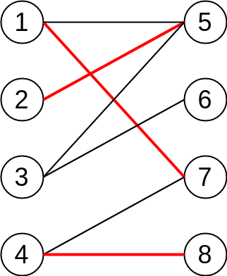


## Hungarian Algorithm

The key idea of Hungarian Algorithm is to find augmenting path. One can prove that a matching is maximum if and only if it does not have any augmenting path. (This result is sometimes called [Berge's lemma](https://en.wikipedia.org/wiki/Berge's_lemma).)


The algorithm starts with any matching $M$ and constructs a tree via a breadth-first search to find an augmenting path, namely a path $P$ that starts and finishes at unmatched vertices whose first and last edges are not in $M$ and whose edges alternate being outside and inside $M$. If the search succeeds, the symmetric difference of $M$ and the edges in $P$ yields a matching with one more edge than $M$ . That edge is added, and then another search is performed for a new augmenting path. If the search is unsuccessful, the algorithm terminates and $M$ must be the largest-size matching.


Again, let's start with an example:

First of all, we begin with vertex **1**, try to find augmenting path. Obviously, the edge connects between 1 and 5 meets our requirement, then we update the path information and stop searching.

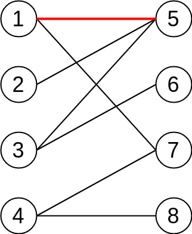


Then, it comes to vertex **2**, and we noticed that 2 and 5 is connected but 5 is occupied by 1 already. Fortunately, however, we can find an augment path, which is from 2 -> 5 -> 1 -> 7. Then as we mentioned before, we switch unmatched edges and matched edges. Finally we will get 1 more matched edges, and the whole process looks like:


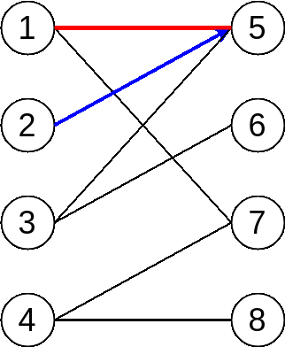


OK, we shift to vertex **3** now, try to find augment path but in vain. We can see the alternating path stops at vertex **2**, but it is a matched vertex. In other words, we are not able to find augment path by following current path.

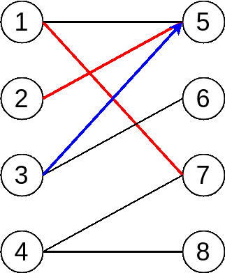


However, vertex **3** has another edge to vertex **6**, and vertex **6** is still unmatched vertex, which indicates the path from 3 to 6 is what? Yes, it is augment path :smile_cat:


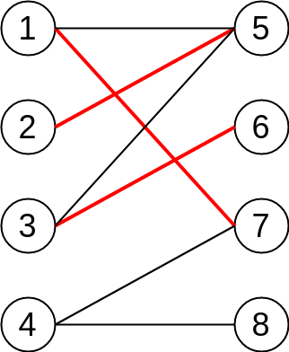


Keep moving to our last vertex **4**, we try to find augment path as well but unfortunately it stuck at vertex **2** again :disappointed:. So we have to give it up and iterate other edges from vertex **4**.

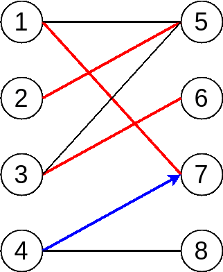

Finally,  we notice that 4 and 8 are both unmatched vertex, and there is an unmatched edge between them.  Bingo! We find the last augment path and the following figure shows the maximum matching result:


## C++ Implementation

```cpp
#include <iostream>
#include <algorithm>
#include <map>
#include "graph.h"

// Maximum Bipartite Matching for Unweighted Graph
class Hungarian {
public:
    explicit Hungarian(int n_u, int n_v) :
    num_vertices_U_(n_u), num_vertices_V_(n_v), g_(n_u + n_v) {
        g_.AddEdge(0, 4);
        g_.AddEdge(0, 5);
        g_.AddEdge(1, 5);
        g_.AddEdge(1, 6);
        g_.AddEdge(2, 4);
        g_.AddEdge(2, 5);
        g_.AddEdge(3, 6);

        total_num_ = n_u + n_v;
        for (int i = 0; i < total_num; i++) {
            matching_[i] = -1;
        }
    }

    void Run() {
        int total_matching = 0;
        for (int i = 0; i < num_vertices_U_; i++) {
            visited_.assign(num_vertices_V_, false);
            if (FindMatching(i)) {
                total_matching++;
            }
        }

        std::cout << "Total = " << total_matching << std::endl;
        for (int i = 0; i < num_vertices_U_; i++) {
            std::cout << i << " -> " << matching_[i] << std::endl;
        }
    }

private:
    Graph g_;
    int num_vertices_U_, num_vertices_V_;
    int total_num_;
    std::vector<bool> visited_;
    std::map<int, int> matching_;

    bool FindMatching(int u) {
        // iterating sets V      
        for (unsigned int v = num_vertices_U_; v < total_num_; v++) {
            // if there is a edge between vertices from U and V
            bool is_connected = 
                std::find(g_.adj_list_[u].cbegin(), g_.adj_list_[u].cend(), v) 
                != g_.adj_list_[u].cend();
            // augmenting path - unmatched -> matched -> ... -> matched -> unmatched
            if (false == visited_[v] && is_connected) {
                visited_[v] = true;
                // if vertex in V is not matched, we will match it
                // if it is matched already, we then go back to set U
                // we will try to figure out if the vertex from U can be 
                // matched with another vertex in V
                // remember unmatched -> matched -> unmatched -> .....
                if (-1 == matching_[v] || FindMatching(matching_[v])) {
                    matching_[v] = u;
                    matching_[u] = v;
                    return true;
                }
            }
        }
        return false;
    } // end of FindMatching function
}; // end of class


int main() {
    // number of vertices on two independent sets U and V
    Hungarian hungarian(4, 4);
    hungarian.Run();
    return 0;
}
```


## References

1. [Hungarian algorithm Wikipedia](https://en.wikipedia.org/wiki/Hungarian_algorithm)
2. [Wolfram - Hungarian Maximum Matching Algorithm](http://mathworld.wolfram.com/HungarianMaximumMatchingAlgorithm.html)
3. [趣写算法系列之--匈牙利算法](https://blog.csdn.net/dark_scope/article/details/8880547)
4. [二分图的最大匹配、完美匹配和匈牙利算法](https://www.renfei.org/blog/bipartite-matching.html)
5. [二分图最大匹配问题与匈牙利算法的核心思想](https://liam.page/2016/04/03/Hungarian-algorithm-in-the-maximum-matching-problem-of-bigraph/)