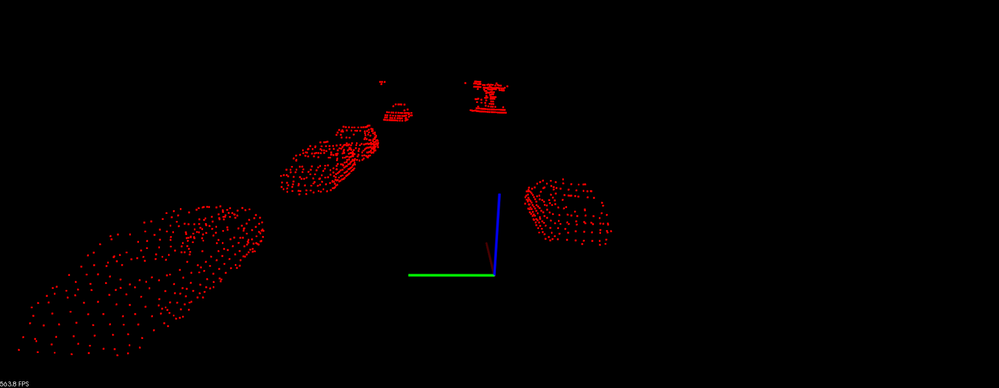
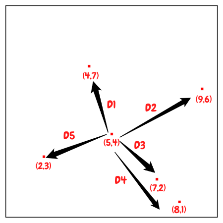
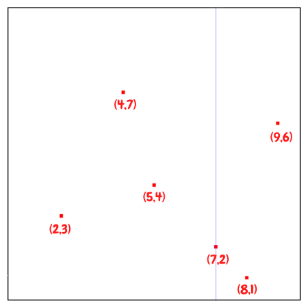
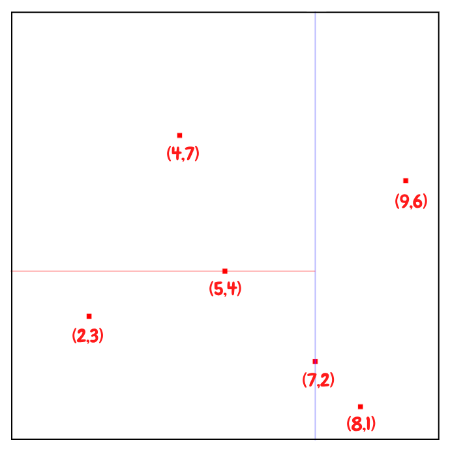
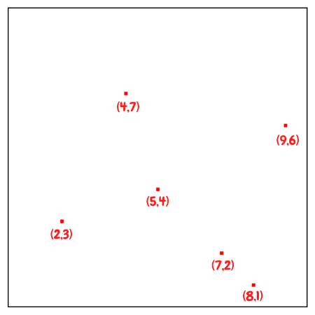
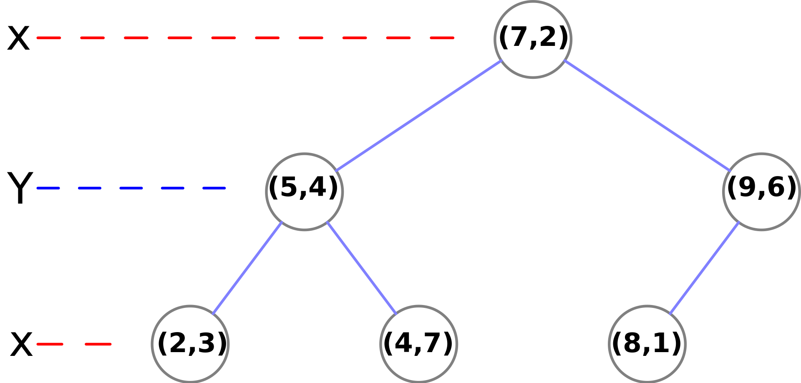
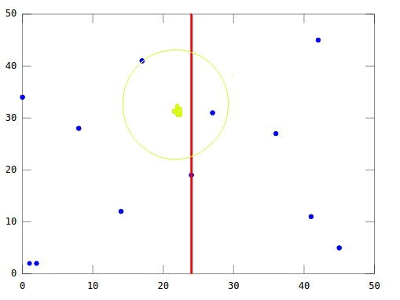

## Introduction

A KD-Tree  (short for *k-dimensional tree*) is a binary tree that splits points between alternating axes. Every leaf node is a *k*-dimensional point. By separating space by splitting regions, nearest neighbor search can be made much faster when using an algorithm like euclidean clustering.


## Problem Statement




Let's assume we get some 3D point clouds from LiDAR scan, and we want to abstract bounding box from each objects and track them. It would be great to break up and regroup the whole point clouds into smaller clusters, especially if you want to do multiple object tracking with cars, pedestrians, and bicyclists, for instance. One way to do that grouping and cluster point cloud data is called euclidean clustering, e.g. using [DBSCAN](<https://en.wikipedia.org/wiki/DBSCAN>).

The basic idea is to associate groups of points by how close together they are. In other words, we need to implement a *nearest neighbor search*.


## Brute-force Nearest Neighbor search



The most naive neighbor search implementation involves the brute-force computation of distances between all pairs of points in the dataset: for $N$ samples in $D$ dimensions, this approach scales as $O(DN^2)$. Efficient brute-force neighbors searches can be very competitive for small data samples. However, as the number of samples $N$ grows, the brute-force approach quickly becomes infeasible.

The improved idea is to associate groups of points by how close together they are. By grouping points into regions in a KD-Tree, you can avoid calculating distance for possibly thousands of points just because you know they are not even considered in a close enough region.


## Building KD-Tree

The key idea of building KD-Tree is to insert points alternating comparison between dimensions. As one moves down the tree, one cycles through the axes used to select the splitting planes. 

For example, in a 3-dimensional tree, the root would have an *x*-aligned plane, the root's children would both have *y*-aligned planes, the root's grandchildren would all have *z*-aligned planes, and so on.


The canonical method of *k*-d tree construction has the following steps:

1. First inserted point becomes root of the tree.
2. Select axis based on depth so that axis cycles through all valid values. In our example: axis = depth % 2 , where depth of root is 0, and axis = 0/1 means to choose x/y axis accordingly.
3. Sort point list by axis and choose median as pivot element. If less branch left, if greater branch right.
4. Traverse tree until node is empty, then assign point to node.
5. Repeat step 2-4 recursively until all of the points processed.


> For step 2, another way to choose the cutting dimension is to calculate the **variance** of all values in each dimension and the largest one will be chosen as the cutting dimension. The larger variance means data is more scatter on the axis, so that we can split data better in this way.


### Balanced Tree

Note that it is not *required* to select the median point. In the case where median points are not selected, there is no guarantee that the tree will be balanced. 

Having a balanced tree that evenly splits regions improves the search time for finding points later. To improve the tree, insert points that alternate between splitting the x region and the y region evenly. 

A popular practice is to sort a *fixed* number of *randomly* *selected* points, and use the median of those points to serve as the splitting plane. In practice, this technique often results in nicely balanced trees.


### Example

Let's start to build KD-Tree with an example.  First of all, we randomly generate 6 points in 2D as our dataset:

```c++
(2,3), (5,4), (9,6), (4,7), (8,1), (7,2)
```


So first of all, we would first insert (7,2) since it is the median along the x axis. Since point (7,2) is the first inserted point, it becomes the root of the tree with depth equals to 0. And this point splits the whole plane into left and right parts.

And then we can divide the rest of the points based on this median point. We will pass the points with $x \leq 7$, which are (2,3), (5,4), (4,7), to left child , and points (8,1), (9,6) with $x \gt 7$ to right child.



The next point to be inserted would be (5, 4), the median of the three points  (2,3), (5,4), (4,7) for y. 



Then build subtrees recursively until all of the points processed.



The resulting KD-Tree.




## Nearest Neighbor Search in KD-Tree

Once we build the KD-Tree, we can then start to search the nearest neighbor of a specific point:

1. Starting with the root node, the algorithm moves down the tree recursively, in the same way that it would if the search point were being inserted (i.e. it goes left or right depending on whether the point is lesser than or greater than the current node in the split dimension).
2. Once the algorithm reaches a leaf node, that node point is saved as the "current best".
3. The algorithm unwinds the recursion of the tree, if the current node is closer than the current best, then it becomes the current best.
4. The algorithm also checks whether there could be any points **on the other side of the splitting plane** that are closer to the search point than the current best. In concept, this is done by intersecting the splitting hyperplane with a hypersphere around the search point that has a radius equal to the current nearest distance. 
   - If the hypersphere crosses the plane, there could be nearer points on the other side of the plane, so the algorithm must move down the other branch of the tree from the current node looking for closer points, following the same recursive process as the entire search.
   - If the hypersphere doesn't intersect the splitting plane, then the algorithm continues walking up the tree, and the entire branch on the other side of that node is eliminated.
5. When the algorithm reaches the root node, then the search is complete.


You may have some questions regarding to step 4. Why we have to move down to the other branch of the tree from the current node?

Question: If a point is on the left plane, is that the closest node will always on the left plane as well?

Answer: NO!


Here is an example:



We are looking for the nearest neighbor of the green point, and we can easily notice that even the green point is on the left side of the plane, however the closest node is on the right side of the plane. So that why we need to check points on the other side of the splitting plane by verifying if the hypersphere crosses the plane.


## Complexity

- Building a static KD-Tree from n points takes $O(n \log n)$ on average
- Find nearest neighbor in a balanced KD-Tree takes $O(\log n)$ time on average.
- Insert a new point into a balanced *k*-d tree takes $O(\log n)$ time.
- Remove a point from a balanced *k*-d tree takes $O(\log n)$ time.


## References

1. [*k*-d tree Wikipedia](<https://en.wikipedia.org/wiki/K-d_tree)
2. [Udacity Sensor Fusion Nanodegree Program](<https://www.udacity.com/course/sensor-fusion-engineer-nanodegree--nd313>)
3. [sklearn - Nearest Neighbor Algorithms](<https://scikit-learn.org/stable/modules/neighbors.html>)
4. [Kd-Tree算法原理和开源实现代码](https://www.cnblogs.com/chenying99/p/4919252.html)
5. [KD Tree的原理及Python实现](<https://zhuanlan.zhihu.com/p/45346117>)
6. [kd 树算法之思路篇](<https://zhuanlan.zhihu.com/p/22557068>)
7. [kd 树算法之详细篇](<https://zhuanlan.zhihu.com/p/23966698>)