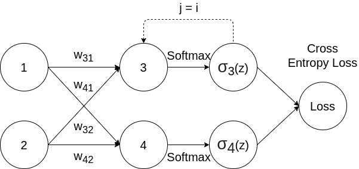
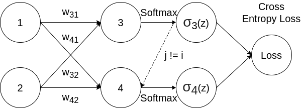

## Softmax Function

The softmax function is a function that takes a vector of $K$ real numbers as input, and normalizes it into a probability distribution. After applying softmax, each input will be in the interval (0, 1), and all of the inputs will add up to 1, so that they can be interpreted as probabilities.

Softmax function is defined by: 
$$
\sigma_i(z) = \frac{e^{z_i}} {\sum_{j=1}^{K} e^{z_j}}
$$

$$
\text{For} \ i = 1, ..., K \ \text{and} \ z = (z_1, ... , z_K) \in \mathbb{R}^k
$$

Note that in neural network, $z_i$ could come from the last convolutional layer or fully-connected layer, which indicates the unnormalized score of the element.

### Example

|               | $z_1$         | $z_2$         |     $z_3$     |
| ------------- | ------------- | ------------- | :-----------: |
| z             | 3             | 4             |       1       |
| $e^{z_i}$     | 20.0855369232 | 54.5981500331 | 2.71828182846 |
| $\sigma_i(z)$ | 0.25949646034 | 0.70538451269 | 0.03511902695 |

$\sigma_2(z) = \frac{54.5981500331}{20.0855369232 + 54.5981500331 +2.71828182846} = 0.70538451269 $

## Derivative of Softmax Loss

We will try to differentiate the softmax function with respect to the cross entropy loss. 

> Sometimes we use softmax loss to stand for the combination of softmax function and cross entropy loss.
>
> Softmax function is an activation function, and cross entropy loss is a loss function. Softmax function can also work with other loss functions.

The cross entropy loss can be defined as:
$$
L_i = - \sum_{i=1}^{K} y_i log(\sigma_i(z))
$$
Note that for multi-class classification problem, we assume that each sample is assigned to one and only one label. So following [one-hot encoding](https://en.wikipedia.org/wiki/One-hot), we choose $y_i = 1$ for the label that matches with ground truth data, and all other labels will be $y_i = 0$. Thus we can simplify the equation above as:
$$
L_i = -\log (\sigma_i(z) ) = -\log(\frac{e^{z_i}} {\sum_{j=1}^{K} e^{z_j}})
$$
And:
$$
z_i = w_{i1}x_1 + w_{i2}x_2 + ...
$$
According to chain rule:
$$
\frac {\partial L_i} {\partial w} = 
\frac {\partial L_i} {\partial \sigma_i(z)} \times
\frac {\partial \sigma_i(z)} {\partial z_j} \times
\frac {\partial z_j} {\partial w}
$$

Let's break it down:
$$
\frac {\partial L_i} {\partial \sigma_i(z)} = - \frac{1}{\sigma_i(z)}
$$

For simplicity, we use $\sum$ to denote $\sum_{j=1}^{K} e^{z_j}$ for following equations:
$$
\begin{aligned}
\frac {\partial \sigma_i(z)} {\partial z_j}
&= \frac{\partial} {\partial z_j} (\frac{e^{z_i}} {\sum}) \\\\ 
&= \frac {\frac {\partial} {\partial z_j} (e^{z_i}) \times \sum -   e^{z_i} \times \frac {\partial} {\partial z_j} (\sum) } {(\sum)^2}
\end{aligned}
$$

There are 2 cases:
1. Same:  $i = j$
	
	
	
	
	$$
	\begin{aligned} 
	\frac {\partial \sigma_i(z)} {\partial z_j}
	&=  \frac {e^{z_i} \times \sum -   e^{z_i} \times e^{z_i} } {(\sum)^2} \\\\
	&= \frac{e^{z_i}}{\sum} - \frac{e^{z_i}}{\sum} \times \frac{e^{z_i}}{\sum} \\\\
&= \sigma_i(z) (1 - \sigma_i(z))
	\end{aligned}
	$$
	
	So that:
	$$
\frac {\partial L_i} {\partial \sigma_i(z)} \times
	\frac {\partial \sigma_i(z)} {\partial s_j} = - \frac{1}{\sigma_i(z)} \times \sigma_i(z) (1 - \sigma_i(z)) =  \sigma_i(z) - 1
	$$
	
2. Different: $i \ne j$

  

  

  
  $$
  \begin{aligned} 
  \frac {\partial \sigma_i(z)} {\partial z_j}
  &=  \frac {0 \times \sum -   e^{z_i} \times e^{z_j} } {(\sum)^2} \\
  &= - \frac{e^{z_i}}{\sum} \times \frac{e^{z_j}}{\sum} \\
  &= -\sigma_i(z)  \sigma_j(z)
  \end{aligned}
  $$

  So that: 
  $$
  \frac {\partial L_i} {\partial \sigma_i(z)} \times
  \frac {\partial \sigma_i(z)} {\partial z_j} = - \frac{1}{\sigma_i(z)} \times  -\sigma_i(z)  \sigma_j(z) =  \sigma_j(z)
  $$

### Example

Here we assume the second class is the correct label, in other words $y_2 = 1$

|                    | $z_1$         | $z_2$              |     $z_3$     |
| ------------------ | ------------- | ------------------ | :-----------: |
| z                  | 3             | 4                  |       1       |
| $e^{z_i}$          | 20.0855369232 | 54.5981500331      | 2.71828182846 |
| $\sigma_i(z)$      | 0.25949646034 | 0.70538451269      | 0.03511902695 |
| Partial derivative | 0.25949646034 | **-0.29461548731** | 0.03511902695 |

## Cross entropy loss vs. SVM loss

SVM loss cares about getting the correct score greater than a margin above the incorrect scores. **Then it will give up.** The SVM is happy once the margins are satisfied and it does not micromanage the exact scores beyond this constraint. 

Cross entropy actually always wants to drive that probability mass all the way to 1. So even if you are giving very high score to the correct class, and very low score to all the incorrect classes, softmax still want you to pile more and more probability mass on the correct class and **continue to push the score of that correct class up towards infinity**.

## References

1. [Understanding softmax and the negative log-likelihood](https://ljvmiranda921.github.io/notebook/2017/08/13/softmax-and-the-negative-log-likelihood/#derivative-of-the-softmax)
2. [详解softmax函数以及相关求导过程](https://zhuanlan.zhihu.com/p/25723112)
3. [Softmax函数与交叉熵](https://zhuanlan.zhihu.com/p/27223959)
4. [CS231n: Linear Classification](https://cs231n.github.io/linear-classify/)